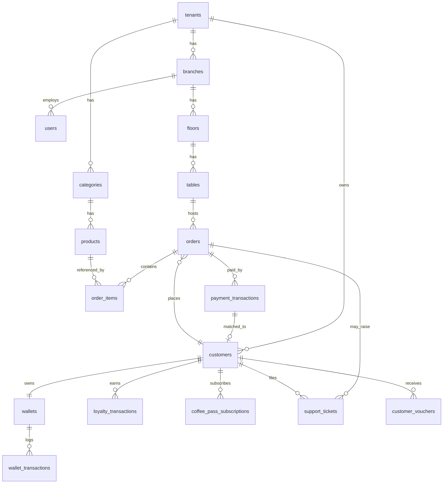

# ERD.md — Sơ Đồ Quan Hệ & DDL

> Nguồn nghiệp vụ: `SPEC.md`. Mọi tên bảng/cột tại đây là **chuẩn duy nhất** — `API_CONTRACT.md`, `RLS_POLICIES.md`, `REALTIME_EVENTS.md` phải tham chiếu đúng theo file này.
> DB: PostgreSQL (qua Supabase). Auth: Supabase Auth (bảng `auth.users` do Supabase quản lý, `users`/`customers` bên dưới là bảng nghiệp vụ liên kết qua `auth_user_id`).

## 1. Sơ đồ quan hệ (rút gọn, dạng mermaid)



## 2. DDL đầy đủ

```sql
CREATE EXTENSION IF NOT EXISTS "uuid-ossp";
CREATE EXTENSION IF NOT EXISTS "pg_trgm"; -- hỗ trợ Levenshtein / similarity

-- ============ TENANCY ============

CREATE TABLE tenants (
    id UUID PRIMARY KEY DEFAULT uuid_generate_v4(),
    name VARCHAR(255) NOT NULL,
    subdomain VARCHAR(100) UNIQUE NOT NULL,
    created_at TIMESTAMPTZ DEFAULT CURRENT_TIMESTAMP
);

CREATE TABLE branches (
    id UUID PRIMARY KEY DEFAULT uuid_generate_v4(),
    tenant_id UUID REFERENCES tenants(id) ON DELETE CASCADE,
    name VARCHAR(255) NOT NULL,
    address TEXT,
    created_at TIMESTAMPTZ DEFAULT CURRENT_TIMESTAMP
);

-- ============ IDENTITY ============

-- Tài khoản nội bộ (OWNER / STAFF / SUPPORT). CUSTOMER dùng bảng `customers`.
CREATE TABLE users (
    id UUID PRIMARY KEY DEFAULT uuid_generate_v4(),
    auth_user_id UUID UNIQUE NOT NULL, -- liên kết auth.users của Supabase
    tenant_id UUID REFERENCES tenants(id) ON DELETE CASCADE,
    branch_id UUID REFERENCES branches(id) ON DELETE SET NULL,
    full_name VARCHAR(150) NOT NULL,
    role VARCHAR(20) NOT NULL CHECK (role IN ('OWNER','STAFF','SUPPORT')),
    phone VARCHAR(20),
    is_active BOOLEAN NOT NULL DEFAULT TRUE,
    created_at TIMESTAMPTZ DEFAULT CURRENT_TIMESTAMP
);
CREATE INDEX idx_users_tenant ON users(tenant_id);
CREATE UNIQUE INDEX idx_users_tenant_phone ON users(tenant_id, phone) WHERE phone IS NOT NULL;

CREATE TABLE customers (
    id UUID PRIMARY KEY DEFAULT uuid_generate_v4(),
    auth_user_id UUID UNIQUE, -- liên kết auth.users, NULL nếu khách vãng lai chưa đăng ký
    tenant_id UUID REFERENCES tenants(id) ON DELETE CASCADE,
    phone VARCHAR(20) NOT NULL,
    full_name VARCHAR(150),
    email VARCHAR(150),
    membership_tier VARCHAR(20) DEFAULT 'STANDARD' CHECK (membership_tier IN ('STANDARD','SILVER','GOLD','DIAMOND')),
    loyalty_points INT DEFAULT 0,
    total_spent NUMERIC(15,2) DEFAULT 0.00,
    total_visits INT DEFAULT 0,
    first_visit_at TIMESTAMPTZ,
    last_visit_at TIMESTAMPTZ,
    favorite_items JSONB DEFAULT '[]'::jsonb,
    dietary_notes TEXT,
    created_at TIMESTAMPTZ DEFAULT CURRENT_TIMESTAMP,
    CONSTRAINT unique_tenant_phone UNIQUE (tenant_id, phone)
);
CREATE INDEX idx_customers_phone ON customers(phone);
CREATE INDEX idx_customers_tenant ON customers(tenant_id);

-- ============ FLOOR MAP ============

CREATE TABLE floors (
    id UUID PRIMARY KEY DEFAULT uuid_generate_v4(),
    branch_id UUID REFERENCES branches(id) ON DELETE CASCADE,
    name VARCHAR(100) NOT NULL,
    floor_level INT NOT NULL,
    background_svg TEXT,
    created_at TIMESTAMPTZ DEFAULT CURRENT_TIMESTAMP
);

CREATE TABLE tables (
    id UUID PRIMARY KEY DEFAULT uuid_generate_v4(),
    floor_id UUID REFERENCES floors(id) ON DELETE CASCADE,
    table_code VARCHAR(50) NOT NULL,
    capacity INT DEFAULT 4,
    pos_x FLOAT NOT NULL,
    pos_y FLOAT NOT NULL,
    width FLOAT DEFAULT 80.0,
    height FLOAT DEFAULT 80.0,
    shape VARCHAR(20) DEFAULT 'RECTANGLE',
    status VARCHAR(20) DEFAULT 'AVAILABLE' CHECK (status IN ('AVAILABLE','PENDING_LOCK','RESERVED','OCCUPIED','CLEANING')),
    current_order_id UUID,
    updated_at TIMESTAMPTZ DEFAULT CURRENT_TIMESTAMP
);
CREATE INDEX idx_tables_floor ON tables(floor_id);

-- ============ MENU ============

CREATE TABLE categories (
    id UUID PRIMARY KEY DEFAULT uuid_generate_v4(),
    tenant_id UUID REFERENCES tenants(id) ON DELETE CASCADE,
    name VARCHAR(100) NOT NULL,
    kitchen_station VARCHAR(20) NOT NULL CHECK (kitchen_station IN ('BAR','KITCHEN')),
    created_at TIMESTAMPTZ DEFAULT CURRENT_TIMESTAMP
);
CREATE UNIQUE INDEX idx_categories_tenant_name ON categories(tenant_id, name);

CREATE TABLE products (
    id UUID PRIMARY KEY DEFAULT uuid_generate_v4(),
    tenant_id UUID REFERENCES tenants(id) ON DELETE CASCADE,
    category_id UUID REFERENCES categories(id) ON DELETE SET NULL,
    name VARCHAR(255) NOT NULL,
    price NUMERIC(15,2) NOT NULL,
    is_active BOOLEAN DEFAULT TRUE,
    default_modifiers JSONB DEFAULT '[]'::jsonb,
    created_at TIMESTAMPTZ DEFAULT CURRENT_TIMESTAMP
);
CREATE INDEX idx_products_tenant ON products(tenant_id);

-- ============ ORDERS ============

CREATE TABLE orders (
    id UUID PRIMARY KEY DEFAULT uuid_generate_v4(),
    tenant_id UUID REFERENCES tenants(id) ON DELETE CASCADE,
    branch_id UUID REFERENCES branches(id) ON DELETE CASCADE,
    table_id UUID REFERENCES tables(id),
    customer_id UUID REFERENCES customers(id),
    order_code VARCHAR(50) UNIQUE NOT NULL,
    order_type VARCHAR(20) DEFAULT 'DINE_IN' CHECK (order_type IN ('DINE_IN','TAKEAWAY')),
    status VARCHAR(20) DEFAULT 'PENDING' CHECK (status IN ('PENDING','IN_PROGRESS','COMPLETED','CANCELLED')),
    subtotal NUMERIC(15,2) DEFAULT 0.00,
    discount_amount NUMERIC(15,2) DEFAULT 0.00,
    final_amount NUMERIC(15,2) DEFAULT 0.00,
    points_earned INT DEFAULT 0,
    points_redeemed INT DEFAULT 0,
    payment_method VARCHAR(30) CHECK (payment_method IN ('VIETQR','WALLET','COFFEE_PASS')),
    created_at TIMESTAMPTZ DEFAULT CURRENT_TIMESTAMP
);
CREATE INDEX idx_orders_tenant ON orders(tenant_id);
CREATE INDEX idx_orders_table ON orders(table_id);

CREATE TABLE order_items (
    id UUID PRIMARY KEY DEFAULT uuid_generate_v4(),
    order_id UUID REFERENCES orders(id) ON DELETE CASCADE,
    product_id UUID REFERENCES products(id),
    product_name VARCHAR(255) NOT NULL,
    quantity INT NOT NULL DEFAULT 1,
    unit_price NUMERIC(15,2) NOT NULL,
    modifiers JSONB DEFAULT '[]'::jsonb,
    kitchen_status VARCHAR(20) DEFAULT 'QUEUED' CHECK (kitchen_status IN ('QUEUED','PREPARING','READY','SERVED')),
    added_by_customer_id UUID REFERENCES customers(id), -- phục vụ Group-Order: ai trong bàn thêm món này
    created_at TIMESTAMPTZ DEFAULT CURRENT_TIMESTAMP
);

-- ============ PAYMENTS ============

CREATE TABLE payment_transactions (
    id UUID PRIMARY KEY DEFAULT uuid_generate_v4(),
    tenant_id UUID REFERENCES tenants(id) ON DELETE CASCADE,
    order_id UUID REFERENCES orders(id),
    reservation_code VARCHAR(50), -- mã RES_XXXXX khi là tiền cọc đặt bàn
    amount NUMERIC(15,2) NOT NULL,
    raw_transfer_content TEXT, -- nội dung chuyển khoản thực tế nhận từ webhook
    status VARCHAR(20) DEFAULT 'PENDING' CHECK (status IN ('PENDING','MATCHED','UNMATCHED','COMPLETED','FAILED')),
    matched_customer_id UUID REFERENCES customers(id),
    created_at TIMESTAMPTZ DEFAULT CURRENT_TIMESTAMP
);
CREATE INDEX idx_payment_tx_status ON payment_transactions(status);

CREATE TABLE unmatched_transactions (
    id UUID PRIMARY KEY DEFAULT uuid_generate_v4(),
    payment_transaction_id UUID REFERENCES payment_transactions(id) ON DELETE CASCADE,
    suggested_customer_id UUID REFERENCES customers(id),
    similarity_score FLOAT, -- kết quả thuật toán Levenshtein/pg_trgm
    maker_user_id UUID REFERENCES users(id),
    maker_proposed_at TIMESTAMPTZ,
    checker_user_id UUID REFERENCES users(id),
    checker_approved_at TIMESTAMPTZ,
    status VARCHAR(20) DEFAULT 'PENDING' CHECK (status IN ('PENDING','PROPOSED','APPROVED','REJECTED')),
    created_at TIMESTAMPTZ DEFAULT CURRENT_TIMESTAMP
);

-- ============ WALLET & COFFEE PASS ============

CREATE TABLE wallets (
    id UUID PRIMARY KEY DEFAULT uuid_generate_v4(),
    customer_id UUID UNIQUE REFERENCES customers(id) ON DELETE CASCADE,
    main_balance NUMERIC(15,2) DEFAULT 0.00,     -- ví gốc (doanh thu thực khi tiêu)
    promo_balance NUMERIC(15,2) DEFAULT 0.00,    -- ví khuyến mãi (chi phí marketing khi tiêu)
    updated_at TIMESTAMPTZ DEFAULT CURRENT_TIMESTAMP
);

CREATE TABLE wallet_transactions (
    id UUID PRIMARY KEY DEFAULT uuid_generate_v4(),
    wallet_id UUID REFERENCES wallets(id) ON DELETE CASCADE,
    order_id UUID REFERENCES orders(id),
    type VARCHAR(20) NOT NULL CHECK (type IN ('TOPUP','PAYMENT','REFUND','PROMO_CREDIT')),
    balance_type VARCHAR(10) NOT NULL CHECK (balance_type IN ('MAIN','PROMO')),
    amount NUMERIC(15,2) NOT NULL,
    balance_after NUMERIC(15,2) NOT NULL,
    created_at TIMESTAMPTZ DEFAULT CURRENT_TIMESTAMP
);

CREATE TABLE coffee_pass_plans (
    id UUID PRIMARY KEY DEFAULT uuid_generate_v4(),
    tenant_id UUID REFERENCES tenants(id) ON DELETE CASCADE,
    name VARCHAR(150) NOT NULL,
    total_redemptions INT NOT NULL,
    price NUMERIC(15,2) NOT NULL,
    valid_days INT NOT NULL
);

CREATE TABLE coffee_pass_subscriptions (
    id UUID PRIMARY KEY DEFAULT uuid_generate_v4(),
    customer_id UUID REFERENCES customers(id) ON DELETE CASCADE,
    plan_id UUID REFERENCES coffee_pass_plans(id),
    remaining_redemptions INT NOT NULL,
    totp_secret VARCHAR(64) NOT NULL, -- secret sinh mã TOTP 30s
    expires_at TIMESTAMPTZ NOT NULL,
    created_at TIMESTAMPTZ DEFAULT CURRENT_TIMESTAMP
);

-- ============ LOYALTY / CDP ============

CREATE TABLE loyalty_transactions (
    id UUID PRIMARY KEY DEFAULT uuid_generate_v4(),
    customer_id UUID REFERENCES customers(id) ON DELETE CASCADE,
    order_id UUID REFERENCES orders(id),
    type VARCHAR(20) NOT NULL CHECK (type IN ('EARN','REDEEM')),
    points INT NOT NULL,
    balance_after INT NOT NULL,
    description TEXT,
    created_at TIMESTAMPTZ DEFAULT CURRENT_TIMESTAMP
);

CREATE TABLE customer_vouchers (
    id UUID PRIMARY KEY DEFAULT uuid_generate_v4(),
    customer_id UUID REFERENCES customers(id) ON DELETE CASCADE,
    source VARCHAR(20) NOT NULL CHECK (source IN ('CSAT_APOLOGY','CHURN_REENGAGEMENT','MANUAL')),
    discount_percent INT,
    free_item_product_id UUID REFERENCES products(id),
    is_used BOOLEAN DEFAULT FALSE,
    expires_at TIMESTAMPTZ,
    created_at TIMESTAMPTZ DEFAULT CURRENT_TIMESTAMP
);

-- ============ SUPPORT / CSKH ============

CREATE TABLE support_tickets (
    id UUID PRIMARY KEY DEFAULT uuid_generate_v4(),
    tenant_id UUID REFERENCES tenants(id) ON DELETE CASCADE,
    order_id UUID REFERENCES orders(id),
    customer_id UUID REFERENCES customers(id),
    csat_score INT CHECK (csat_score BETWEEN 1 AND 5),
    complaint_note TEXT,
    priority VARCHAR(10) DEFAULT 'NORMAL' CHECK (priority IN ('NORMAL','URGENT')),
    status VARCHAR(20) DEFAULT 'OPEN' CHECK (status IN ('OPEN','IN_PROGRESS','RESOLVED')),
    assigned_to UUID REFERENCES users(id),
    resolution_note TEXT,
    created_at TIMESTAMPTZ DEFAULT CURRENT_TIMESTAMP
);

CREATE TABLE audit_logs (
    id UUID PRIMARY KEY DEFAULT uuid_generate_v4(),
    tenant_id UUID REFERENCES tenants(id) ON DELETE CASCADE,
    actor_user_id UUID REFERENCES users(id),
    action VARCHAR(100) NOT NULL,
    entity_type VARCHAR(50),
    entity_id UUID,
    metadata JSONB DEFAULT '{}'::jsonb,
    created_at TIMESTAMPTZ DEFAULT CURRENT_TIMESTAMP
);

-- ============ SHIFTS (CA LÀM VIỆC) ============

CREATE TABLE shifts (
    id UUID PRIMARY KEY DEFAULT uuid_generate_v4(),
    tenant_id UUID NOT NULL REFERENCES tenants(id) ON DELETE CASCADE,
    branch_id UUID NOT NULL REFERENCES branches(id) ON DELETE CASCADE,
    opened_by UUID REFERENCES users(id) ON DELETE SET NULL,
    closed_by UUID REFERENCES users(id) ON DELETE SET NULL,
    opened_at TIMESTAMPTZ NOT NULL DEFAULT CURRENT_TIMESTAMP,
    closed_at TIMESTAMPTZ,
    starting_cash NUMERIC(15,2) NOT NULL DEFAULT 0.00,
    ending_cash NUMERIC(15,2),
    status VARCHAR(20) NOT NULL DEFAULT 'OPEN' CHECK (status IN ('OPEN', 'CLOSED')),
    notes TEXT,
    created_at TIMESTAMPTZ DEFAULT CURRENT_TIMESTAMP
);

-- ============ INVENTORY (QUẢN LÝ KHO & ĐỊNH LƯỢNG) ============

CREATE TABLE ingredients (
    id UUID PRIMARY KEY DEFAULT uuid_generate_v4(),
    tenant_id UUID NOT NULL REFERENCES tenants(id) ON DELETE CASCADE,
    name VARCHAR(255) NOT NULL,
    sku VARCHAR(50),
    unit VARCHAR(50) NOT NULL,
    current_stock NUMERIC(15,3) NOT NULL DEFAULT 0.000,
    min_stock_alert NUMERIC(15,3) DEFAULT 0.000,
    cost_per_unit NUMERIC(15,2) DEFAULT 0.00,
    created_at TIMESTAMPTZ DEFAULT CURRENT_TIMESTAMP,
    updated_at TIMESTAMPTZ DEFAULT CURRENT_TIMESTAMP
);

CREATE TABLE product_recipes (
    id UUID PRIMARY KEY DEFAULT uuid_generate_v4(),
    tenant_id UUID NOT NULL REFERENCES tenants(id) ON DELETE CASCADE,
    product_id UUID NOT NULL REFERENCES products(id) ON DELETE CASCADE,
    ingredient_id UUID NOT NULL REFERENCES ingredients(id) ON DELETE CASCADE,
    amount NUMERIC(15,3) NOT NULL,
    created_at TIMESTAMPTZ DEFAULT CURRENT_TIMESTAMP,
    CONSTRAINT uq_product_ingredient UNIQUE (product_id, ingredient_id)
);

CREATE TABLE inventory_transactions (
    id UUID PRIMARY KEY DEFAULT uuid_generate_v4(),
    tenant_id UUID NOT NULL REFERENCES tenants(id) ON DELETE CASCADE,
    branch_id UUID REFERENCES branches(id) ON DELETE CASCADE,
    ingredient_id UUID NOT NULL REFERENCES ingredients(id) ON DELETE CASCADE,
    type VARCHAR(20) NOT NULL CHECK (type IN ('IMPORT', 'EXPORT', 'ADJUSTMENT', 'ORDER_CONSUMPTION')),
    quantity NUMERIC(15,3) NOT NULL,
    balance_after NUMERIC(15,3) NOT NULL,
    notes TEXT,
    created_by UUID REFERENCES users(id) ON DELETE SET NULL,
    created_at TIMESTAMPTZ DEFAULT CURRENT_TIMESTAMP
);
```

## 3. Triggers & Functions nghiệp vụ cốt lõi

### 3.1. `trg_order_completed` — tự động cập nhật CDP khi đơn hàng hoàn tất

```sql
CREATE OR REPLACE FUNCTION fn_update_customer_after_order()
RETURNS TRIGGER AS $$
DECLARE
  v_points_earned INT;
  v_rate NUMERIC := 0.0001;
BEGIN
  IF NEW.status = 'COMPLETED' AND OLD.status <> 'COMPLETED' AND NEW.customer_id IS NOT NULL THEN
    v_points_earned := FLOOR(NEW.final_amount * v_rate);
    NEW.points_earned := v_points_earned;

    UPDATE customers
    SET total_spent = total_spent + NEW.final_amount,
        total_visits = total_visits + 1,
        loyalty_points = loyalty_points + v_points_earned - COALESCE(NEW.points_redeemed, 0),
        last_visit_at = NEW.created_at,
        first_visit_at = COALESCE(first_visit_at, NEW.created_at),
        membership_tier = CASE
          WHEN (total_spent + NEW.final_amount) >= 10000000 THEN 'DIAMOND'
          WHEN (total_spent + NEW.final_amount) >= 5000000 THEN 'GOLD'
          WHEN (total_spent + NEW.final_amount) >= 2000000 THEN 'SILVER'
          ELSE 'STANDARD'
        END
    WHERE id = NEW.customer_id;

    INSERT INTO loyalty_transactions(customer_id, order_id, type, points, balance_after, description)
    SELECT NEW.customer_id, NEW.id, 'EARN', v_points_earned, c.loyalty_points, 'Tích điểm từ đơn hàng ' || NEW.order_code
    FROM customers c WHERE c.id = NEW.customer_id;
  END IF;
  RETURN NEW;
END;
$$ LANGUAGE plpgsql SECURITY DEFINER SET search_path = public;

CREATE TRIGGER trg_order_completed
  BEFORE UPDATE ON orders
  FOR EACH ROW
  EXECUTE FUNCTION fn_update_customer_after_order();
```

### 3.2. So khớp mờ giao dịch lỗi (dùng `pg_trgm` thay Levenshtein thuần)

```sql
CREATE OR REPLACE FUNCTION fn_suggest_customer_match(p_transfer_content TEXT, p_tenant_id UUID)
RETURNS TABLE(customer_id UUID, full_name VARCHAR, similarity_score FLOAT) AS $$
  SELECT c.id, c.full_name, similarity(c.full_name, p_transfer_content) AS score
  FROM customers c
  WHERE c.tenant_id = p_tenant_id
  ORDER BY score DESC
  LIMIT 5;
$$ LANGUAGE sql STABLE;
```
Dùng trong `POST /support/unmatched/{id}/suggest` — xem `API_CONTRACT.md`.

### 3.3. `fn_merge_customer_profiles` — hợp nhất hồ sơ trùng lặp

```sql
CREATE OR REPLACE FUNCTION fn_merge_customer_profiles(source_id UUID, target_id UUID)
RETURNS VOID AS $$
BEGIN
    IF source_id = target_id THEN
        RAISE EXCEPTION 'source_id and target_id must be different';
    END IF;

    IF NOT EXISTS (
        SELECT 1 FROM customers source_customer
        JOIN customers target_customer ON target_customer.tenant_id = source_customer.tenant_id
        WHERE source_customer.id = source_id AND target_customer.id = target_id
    ) THEN
        RAISE EXCEPTION 'customers must belong to the same tenant';
    END IF;

  UPDATE orders SET customer_id = target_id WHERE customer_id = source_id;
  UPDATE loyalty_transactions SET customer_id = target_id WHERE customer_id = source_id;
    UPDATE payment_transactions SET matched_customer_id = target_id WHERE matched_customer_id = source_id;
    UPDATE support_tickets SET customer_id = target_id WHERE customer_id = source_id;
    UPDATE customer_vouchers SET customer_id = target_id WHERE customer_id = source_id;
    UPDATE coffee_pass_subscriptions SET customer_id = target_id WHERE customer_id = source_id;
  UPDATE wallet_transactions SET wallet_id = (SELECT id FROM wallets WHERE customer_id = target_id)
    WHERE wallet_id = (SELECT id FROM wallets WHERE customer_id = source_id);

  UPDATE customers t SET
    total_spent = t.total_spent + s.total_spent,
    total_visits = t.total_visits + s.total_visits,
    loyalty_points = t.loyalty_points + s.loyalty_points,
    first_visit_at = LEAST(t.first_visit_at, s.first_visit_at),
    last_visit_at = GREATEST(t.last_visit_at, s.last_visit_at),
    email = COALESCE(t.email, s.email),
    dietary_notes = COALESCE(t.dietary_notes, s.dietary_notes)
  FROM customers s WHERE s.id = source_id AND t.id = target_id;

  DELETE FROM wallets WHERE customer_id = source_id;
  DELETE FROM customers WHERE id = source_id;
END;
$$ LANGUAGE plpgsql SECURITY DEFINER SET search_path = public;
```

## 4. Ghi chú thiết kế

- Mọi bảng nghiệp vụ chính đều có `tenant_id` trực tiếp hoặc gián tiếp (qua `branch_id`/`order_id`) — bắt buộc để RLS lọc đúng (xem `RLS_POLICIES.md`).
- `order_items.added_by_customer_id` phục vụ tính năng Group-Order: FE hiển thị "món của ai" trong giỏ hàng chung.
- `wallets` tách `main_balance`/`promo_balance` để hỗ trợ sổ cái kép rút gọn (mô tả tại `SPEC.md` mục 3, phần "Ngoài phạm vi").
- `unmatched_transactions.similarity_score` sinh ra từ `pg_trgm.similarity()` (thay thế cho thư viện Levenshtein riêng — cho kết quả tương đương, có sẵn trong Postgres, phù hợp thời gian đồ án).
