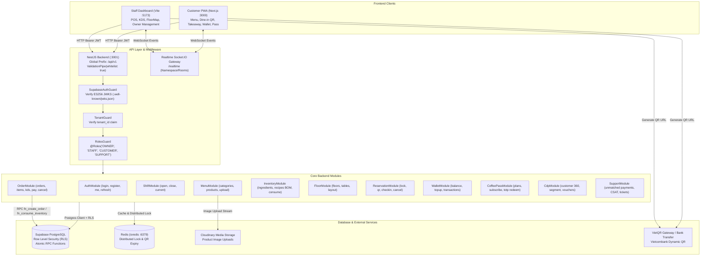

# 01 — KIẾN TRÚC HỆ THỐNG THỰC TẾ (SYSTEM ARCHITECTURE)

> **Dự án:** F&B SaaS Multi-Tenant Platform  
> **Repository:** `https://github.com/TLuon/fnb-saas-platform.git`  
> **Nhánh:** `connectfix`  
> **Ngày khảo sát:** 03/10/2026  

---

## 1. TỔNG QUAN HỆ THỐNG & MONOREPO

Dự án được cấu trúc dưới dạng **NPM Workspaces Monorepo**:
```
fnb-saas-platform/
├── apps/
│   ├── staff-dashboard/      # Giao diện POS, KDS Bếp/Bar, Sơ đồ bàn, Quản lý (React 19 + Vite 8 + TailwindCSS 4)
│   └── customer-pwa/         # Ứng dụng đặt món PWA cho Khách hàng (Next.js 13.4 App Router + TailwindCSS)
├── backend/
│   └── api/                  # REST API & WebSocket Realtime Gateway (NestJS 12 + Supabase PostgreSQL + Redis)
├── packages/
│   ├── types/                # Shared TypeScript Interfaces & Data Models (@fnb/types)
│   ├── ui-shared/            # Shared Canvas & UI Components (@fnb/ui-shared)
│   └── utils/                # API Client (Axios interceptors), Auth Store (Zustand), Realtime Client, VietQR (@fnb/utils)
└── docs/                     # Tài liệu thiết kế, API contract, migration guide & test cases
```

---

## 2. SƠ ĐỒ LUỒNG DỮ LIỆU TOÀN CỤC (LOGICAL ARCHITECTURE)



---

## 3. CƠ CHẾ GIAO TIẾP VÀ XÁC THỰC (AUTHENTICATION & JWT)

### 3.1. Cấu hình API Base URL
- Thư viện trung tâm: `packages/utils/src/api-client.ts`.
- Mặc định: `http://localhost:3001/api/v1`.
- Biến môi trường:
  - Staff Dashboard: `VITE_API_BASE_URL` (hoặc fallback `VITE_API_URL`).
  - Customer PWA: `NEXT_PUBLIC_API_BASE_URL` (hoặc fallback `NEXT_PUBLIC_API_URL`).

### 3.2. Chu trình tạo, truyền và xác thực JWT
1. **Login:** Người dùng gửi email/mật khẩu tới `POST /api/v1/auth/login`. Backend gọi Supabase Auth `signInWithPassword`.
2. **Hook Database:** Khi token được phát hành, Postgres function `public.custom_access_token_hook(event)` tự động chèn custom claims:
   - `role_app`: `users.role` (OWNER/STAFF/SUPPORT) hoặc `'CUSTOMER'` nếu người dùng nằm trong bảng `customers`.
   - `tenant_id`: UUID của quán.
   - `branch_id`: UUID của chi nhánh (nếu có).
3. **Phía Client:** `authStore` lưu JWT vào `localStorage` (`access_token`, `refresh_token`), parse payload và kích hoạt trạng thái đăng nhập. Axios interceptor tự động đính kèm `Authorization: Bearer <access_token>`.
4. **Phía Backend Guard:**
   - `SupabaseAuthGuard`: Tải khóa công khai bất đối xứng ES256 qua JWKS (`.well-known/jwks.json`), xác minh chữ ký, gắn `request.user` và `request.accessToken`.
   - `TenantGuard`: Kiểm tra bắt buộc có `tenant_id`.
   - `RolesGuard`: Đối chiếu vai trò với decorator `@Roles(...)` được khai báo trên handler/controller.

### 3.3. Phân tách dữ liệu (Tenant Isolation & Branch Context)
- **Lớp bảo vệ 1 (Application Guard):** `TenantGuard` chặn ngay request không có `tenant_id`.
- **Lớp bảo vệ 2 (Postgres RLS):** Khi gọi database, backend dùng `supabase.forUser(accessToken)`. Mọi truy vấn đều tự động kiểm tra policy `tenant_id = app_auth.tenant_id()`.
- **Branch Scope:** Nhân viên thuộc chi nhánh nào (`branch_id`) chỉ được phép truy vấn dữ liệu đơn hàng và bàn của chi nhánh đó.

---

## 4. QUẢN LÝ DỊCH VỤ NGOÀI (EXTERNAL SERVICES)

### 4.1. Cloudinary
- Xử lý tại `backend/api/src/common/cloudinary/cloudinary.service.ts`.
- Endpoint: `POST /api/v1/products/upload-image`.
- Validation: MIME type (`image/jpeg`, `image/png`, `image/webp`, `image/gif`), dung lượng tối đa 5MB.
- Lưu trữ: Upload trực tiếp dạng Readable Stream lên Cloudinary folder `products/`, lưu URL an toàn (`secure_url`) vào cột `products.image_url`. Có cơ chế mock fallback an toàn khi chạy unit test/offline.

### 4.2. Redis
- Kết nối thông qua `ioredis` tại `backend/api/src/common/redis.service.ts`.
- Sử dụng cho: Khóa đồng thời giữ bàn (`lockTable`), đặt thời gian hết hạn mã đặt bàn (`reservation:${code}` TTL 600s), chống trùng lặp request đặt bàn.
- Cơ chế chịu lỗi: Phương thức `redisSafe` tự động fallback sang lưu trữ và truy vấn Supabase nếu Redis không khả dụng.
