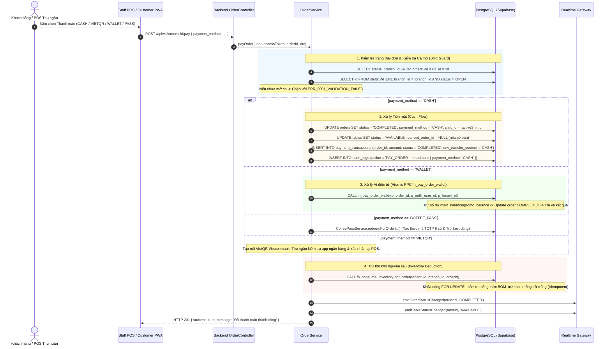

# 02 — CHI TIẾT LOGIC NGHIỆP VỤ THỰC TẾ (BUSINESS LOGIC SPECIFICATION)

> **Dự án:** F&B SaaS Multi-Tenant Platform  
> **Repository:** `https://github.com/TLuon/fnb-saas-platform.git` (branch `connectfix`)  

---

## 1. QUẢN LÝ CA LÀM VIỆC (SHIFT MANAGEMENT)

Mọi hoạt động thu ngân (đặc biệt là thanh toán Tiền mặt `CASH`) đều chịu sự ràng buộc nghiêm ngặt của Ca làm việc.

```
[Nhân viên/Chủ quán]
       │
       ▼
POST /api/v1/shifts/open
  - Input: branch_id, starting_cash, staff_name
  - Processing: Kiểm tra xem chi nhánh đã có ca nào đang 'OPEN' chưa.
  - Database: INSERT vào bảng `shifts` với status = 'OPEN', starting_cash.
  - Output: shift_id, thông tin ca mở.
       │
       ▼ (Trong ca: Thu tiền mặt/chuyển khoản, gắn shift_id vào đơn)
       │
       ▼
POST /api/v1/shifts/:id/close
  - Input: actual_cash, note
  - Processing:
      1. Tính tổng doanh thu tiền mặt: SUM(amount) từ `orders` có `payment_method = 'CASH'` và `shift_id = :id`.
      2. Tính chênh lệch: cash_difference = actual_cash - (starting_cash + cash_sales).
      3. Cập nhật status = 'CLOSED', closed_at = NOW().
  - Output: Báo cáo kết ca và mức lệch quỹ tiền mặt (Over/Short).
```

---

## 2. QUẢN LÝ ĐƠN HÀNG (ORDER MANAGEMENT)

### 2.1. Phân loại đơn hàng
- **DINE_IN (Dùng tại bàn):**
  - Bắt buộc có `table_id`.
  - Bàn phải ở trạng thái khả dụng (`AVAILABLE` hoặc `RESERVED`), không được là `OCCUPIED` hoặc `CLEANING`.
  - Khi tạo đơn, bàn được cập nhật sang `OCCUPIED` và lưu `current_order_id`.
- **TAKEAWAY (Mang đi) & DELIVERY (Giao hàng):**
  - Không ràng buộc bàn (`table_id = NULL`).
  - Giao diện POS hiển thị danh sách đơn mang đi riêng biệt trong Drawer/Tab Takeaway.

### 2.2. Trình tự xử lý tạo đơn (Atomic RPC `fn_create_order`)
1. **Input:** `CreateOrderDto { order_type, table_id?, reservation_code?, branch_id? }`.
2. **Processing:**
   - Xác định `branch_id` từ bàn, profile người dùng hoặc chi nhánh mặc định của tenant.
   - Gọi Database RPC `fn_create_order(p_tenant_id, p_branch_id, p_table_id, p_order_code, p_reservation_code, p_order_type, p_shift_id)`.
3. **Database Execution:**
   - Khóa dòng bàn `FOR UPDATE` (nếu DINE_IN).
   - Nếu có `reservation_code`: Khóa giao dịch tiền cọc `FOR UPDATE` trong bảng `payment_transactions`, kiểm tra chống trừ cọc hai lần, tính `deposit_applied`.
   - Tìm kiếm ca làm việc đang mở (`status = 'OPEN'`) tại chi nhánh để tự động gán `shift_id`.
   - Chèn dòng vào bảng `orders` với `status = 'PENDING'`.
4. **Output:** `order_id`, `order_code`, `deposit_applied`.

---

## 3. LUỒNG THANH TOÁN (PAYMENT WORKFLOW)

Hệ thống hỗ trợ 4 phương thức thanh toán: `CASH`, `VIETQR`, `WALLET`, `COFFEE_PASS`.



---

## 4. QUẢN LÝ TỒN KHO & ĐỊNH LƯỢNG (INVENTORY & RECIPE BOM)

### 4.1. Cơ chế trừ kho tự động khi hoàn tất đơn
- Khi đơn hàng hoàn tất (`targetStatus === 'COMPLETED'`), `OrderService` tự động kích hoạt `InventoryService.consumeForCompletedOrder`.
- Hàm atomic RPC `fn_consume_inventory_for_order` trên PostgreSQL đảm bảo:
  1. **Khóa dòng đơn hàng `FOR UPDATE`:** Ngăn chặn race-condition khi có nhiều request đồng thời.
  2. **Chống trừ trùng (Idempotency):** Kiểm tra xem đã có giao dịch loại `ORDER_CONSUMPTION` cho `order_id` này chưa. Nếu đã có, trả về kết quả thành công và giữ nguyên số liệu tồn kho.
  3. **Khấu trừ nguyên liệu theo công thức BOM:** Duyệt qua các món trong đơn hàng (`order_items`), tìm công thức pha chế tương ứng (`recipes`), nhân với số lượng món và cập nhật `ingredients.current_stock = current_stock - required_quantity`.
  4. **Ghi sổ nhật ký giao dịch kho:** `inventory_transactions` với loại `ORDER_CONSUMPTION`.
  5. **Cảnh báo hết hàng:** Nếu tồn kho sau khi trừ rơi xuống dưới mức cảnh báo `min_stock_alert`, hệ thống tự động bắn WebSocket event `product_out_of_stock` tới quản lý chi nhánh.

---

## 5. MÀN HÌNH BẾP & PHA CHẾ (KDS BOARD)

- **Hai khu vực độc lập:** Bếp ăn (`KDSKitchen` - station `KITCHEN`) và Quầy pha chế (`KDSBar` - station `BAR`).
- **Phân loại theo Món (Order Items):** Không gom chung theo đơn để tránh tình trạng cả đơn bị nghẽn khi một món cần chế biến lâu hơn.
- **Máy trạng thái chế biến:**
  $$\text{QUEUED} \xrightarrow{\text{Nhận làm}} \text{PREPARING} \xrightarrow{\text{Nấu xong}} \text{READY} \xrightarrow{\text{Bưng ra bàn}} \text{SERVED}$$
- Mọi thao tác đổi trạng thái đều đồng bộ tức thời qua Socket.IO event `kds_item_status_changed`.
