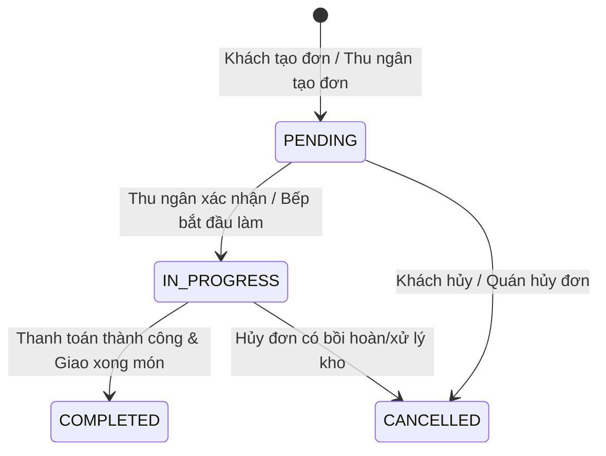
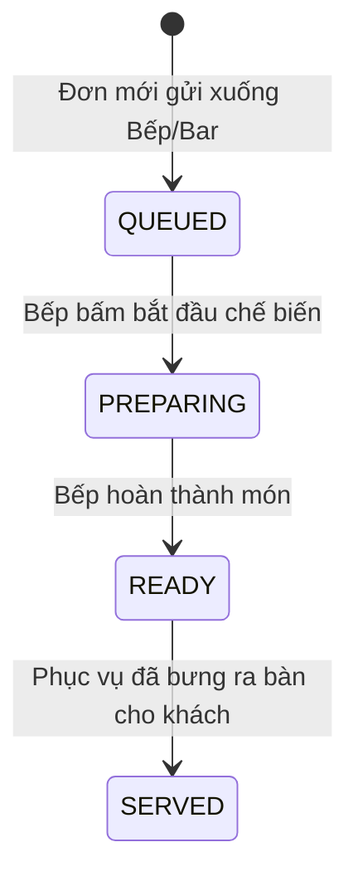
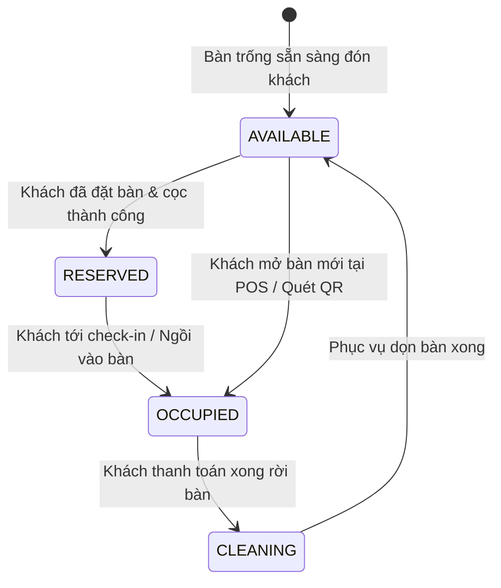
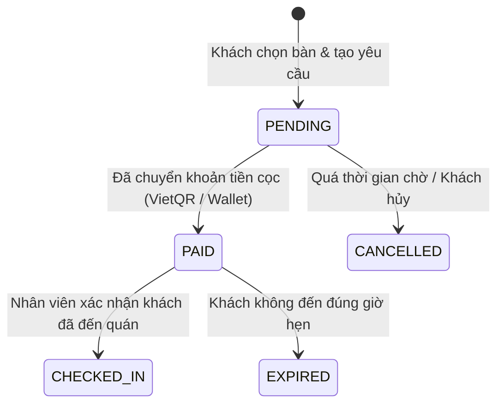
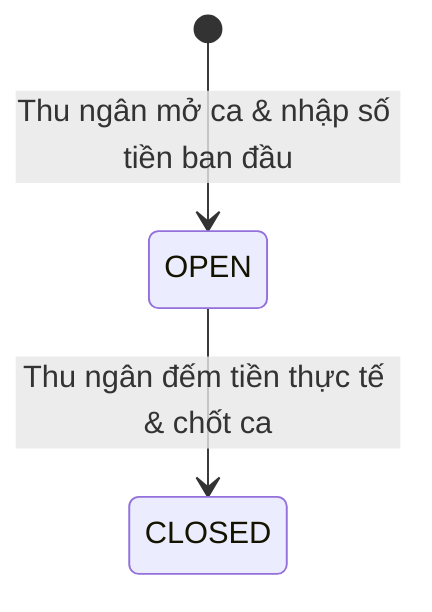
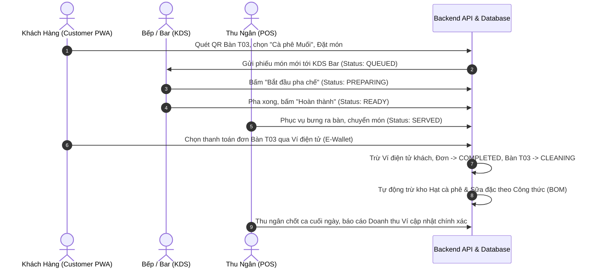
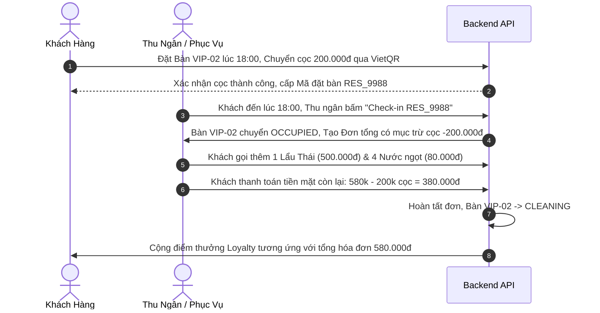
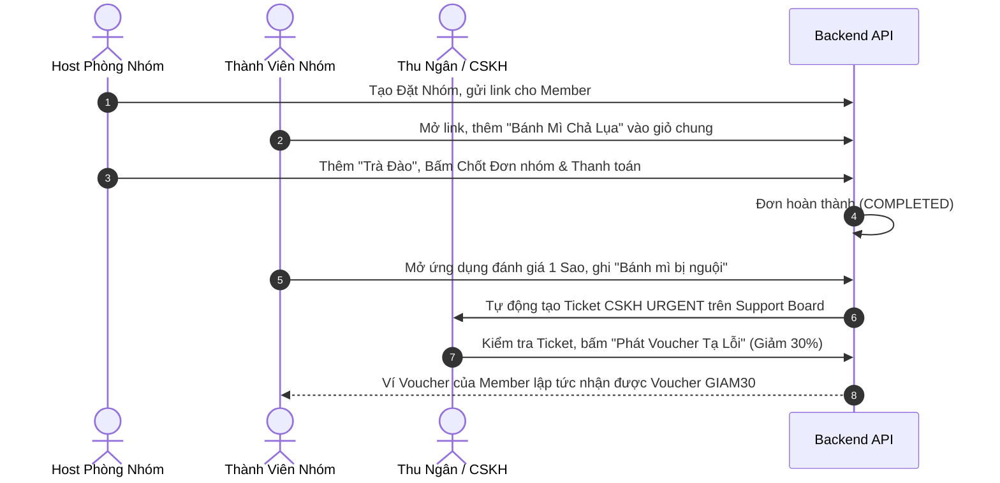

# BÁO CÁO PHÂN TÍCH CHUYÊN SÂU LUỒNG HOẠT ĐỘNG & BỘ TEST CASES DỰ ÁN F&B SAAS PLATFORM

> **Tài liệu kiểm thử và Luồng vận hành toàn hệ thống (Test Cases & Operational Workflow)**
> **Mã dự án:** `fnb-saas-platform`  
> **Phiên bản tài liệu:** `1.0.0`  
> **Cập nhật lần cuối:** `03/10/2026`  

---

## MỤC LỤC

1. [TỔNG QUAN KIẾN TRÚC & CÁC NGUYÊN TẮC VẬN HÀNH](#1-tổng-quan-kiến-trúc--các-nguyên-tắc-vận-hành)
   - 1.1 Phân hệ ứng dụng & Công nghệ sử dụng
   - 1.2 Mô hình Dữ liệu Đa người dùng (Multi-tenancy & RLS)
   - 1.3 Các Máy Trạng thái Dữ liệu (State Machines)
2. [LUỒNG HOẠT ĐỘNG & TEST CASES - PHÂN HỆ KHÁCH HÀNG (CUSTOMER PWA)](#2-luồng-hoạt-động--test-cases---phân-hệ-khách-hàng-customer-pwa)
   - TC-CUS-01: Đăng ký / Đăng nhập / Hồ sơ cá nhân & Loyalty Tier
   - TC-CUS-02: Duyệt Menu, Tìm kiếm, Lọc danh mục & Chọn Modifier món
   - TC-CUS-03: Quản lý Giỏ hàng & Áp dụng Voucher Khuyến mãi
   - TC-CUS-04: Đặt hàng tại bàn qua QR Code (Dine-in)
   - TC-CUS-05: Đặt hàng Mang đi (Takeaway) & Giao hàng (Delivery)
   - TC-CUS-06: Đặt hàng Nhóm Real-time (Group Order Multi-user)
   - TC-CUS-07: Đặt bàn trước & Thanh toán tiền cọc (Reservation & Deposit)
   - TC-CUS-08: Đăng ký & Đổi thưởng Gói Nước (Coffee Pass TOTP QR)
   - TC-CUS-09: Nạp tiền & Thanh toán bằng Ví điện tử (E-Wallet Main & Promo)
   - TC-CUS-10: Theo dõi Đơn hàng Real-time & Đánh giá Dịch vụ (CSAT Feedback)
3. [LUỒNG HOẠT ĐỘNG & TEST CASES - PHÂN HỆ NHÂN VIÊN THU NGÂN / PHỤC VỤ (STAFF DASHBOARD)](#3-luồng-hoạt-động--test-cases---phân-hệ-nhân-viên-thu-ngân--phục-vụ-staff-dashboard)
   - TC-STF-01: Quản lý Ca làm việc & Khai báo tiền mặt đầu ca (Shift Management)
   - TC-STF-02: Bán hàng tại điểm POS (Tạo đơn, Tùy chỉnh Modifier, Áp giảm giá)
   - TC-STF-03: Quản lý Sơ đồ bàn Live Floor Map (Chuyển bàn, Gộp bàn, Tách đơn)
   - TC-STF-04: Xử lý Thanh toán Đa phương thức & Quét mã Coffee Pass TOTP
   - TC-STF-05: Tiếp đón Khách đặt bàn trước (Reservation Check-in & Trừ cọc)
   - TC-STF-06: Xử lý Yêu cầu Khách hàng & Ticket CSKH (Support Board)
   - TC-STF-07: Kiểm kê Tiền thực tế, Chốt ca & In báo cáo lệch quỹ (Shift Close)
4. [LUỒNG HOẠT ĐỘNG & TEST CASES - PHÂN HỆ BẾP & PHA CHẾ (KITCHEN & BAR KDS)](#4-luồng-hoạt-động--test-cases---phân-hệ-bếp--pha-chế-kitchen--bar-kds)
   - TC-KDS-01: Tiếp nhận & Chế biến Món ăn (KDS Kitchen Station)
   - TC-KDS-02: Tiếp nhận & Pha chế Thức uống (KDS Bar Station)
   - TC-KDS-03: Chuyển Trạng thái Món Real-time (QUEUED -> PREPARING -> READY -> SERVED)
   - TC-KDS-04: Cảnh báo Đơn chờ lâu (Overdue Time Alert)
   - TC-KDS-05: Xử lý Hủy món / Thay đổi thông tin món từ POS
5. [LUỒNG HOẠT ĐỘNG & TEST CASES - PHÂN HỆ CHỦ QUÁN / QUẢN LÝ (OWNER & MANAGER)](#5-luồng-hoạt-động--test-cases---phân-hệ-chủ-quán--quản-lý-owner--manager)
   - TC-OWN-01: Quản lý Thực đơn, Danh mục & Modifier (Menu Management)
   - TC-OWN-02: Thiết kế Sơ đồ Bàn Drag-and-Drop (Floor Editor)
   - TC-OWN-03: Quản lý Định lượng & Công thức Chế biến (Inventory & Recipe BOM)
   - TC-OWN-04: Kiểm soát Xuất/Nhập Kho & Điều chỉnh Cân bằng Kho
   - TC-OWN-05: Quản lý Nhân viên & Phân quyền Truy cập (Staff RBAC)
   - TC-OWN-06: Phân tích Dữ liệu Khách hàng CDP & Customer 360
   - TC-OWN-07: Báo cáo Doanh thu, Lợi nhuận & Phân tích Giờ cao điểm (Analytics)
6. [KỊCH BẢN KIỂM THỬ TÍNH TÍCH HỢP TOÀN DIỆN (END-TO-END E2E TEST SCENARIOS)](#6-kịch-bản-kiểm-thử-tính-tích-hợp-toàn-diện-end-to-end-e2e-test-scenarios)
   - E2E-01: Luồng Đặt món tại bàn qua QR -> Bếp chế biến -> Thanh toán Ví -> Trừ kho BOM -> Chốt ca.
   - E2E-02: Luồng Đặt bàn cọc Online -> Khách tới Check-in -> Phục vụ thêm món -> Trừ cọc tính tiền -> Tích điểm Loyalty.
   - E2E-03: Luồng Đặt hàng nhóm realtime -> Host thanh toán -> Khách đánh giá 1 sao -> Tự động phát voucher tạ lỗi.

---

## 1. TỔNG QUAN KIẾN TRÚC & CÁC NGUYÊN TẮC VẬN HÀNH

### 1.1 Phân hệ ứng dụng & Công nghệ sử dụng
Hệ thống **F&B SaaS Platform** bao gồm 3 phân hệ chính kết nối qua Rest API / WebSocket Realtime:
1. **Customer PWA (`apps/customer-pwa`)**: Ứng dụng Web dành cho Khách hàng (Next.js App Router, TailwindCSS, Zustand State, Dynamic TOTP Generator).
2. **Staff & Management Dashboard (`apps/staff-dashboard`)**: Dashboards dành cho Thu ngân, Phục vụ, Bếp/Bar, Chủ quán (React + Vite, Lucide Icons, Canvas Floor Map Editor).
3. **Backend API (`backend/api`)**: Hệ thống xử lý trung tâm (NestJS, PostgreSQL / Supabase, Row Level Security, JWT Authentication).

---

### 1.2 Mô hình Dữ liệu Đa người dùng (Multi-tenancy & RLS)
- Mọi dữ liệu (Order, Menu, Inventory, Staff, Customer) đều gắn liền với `tenant_id` và `branch_id`.
- Hệ thống áp dụng **Row Level Security (RLS)** trên PostgreSQL để bảo đảm dữ liệu giữa các Quán/Chi nhánh không bị rò rỉ.

---

### 1.3 Các Máy Trạng thái Dữ liệu (State Machines)

#### a. Trạng thái Đơn hàng (`orders.status`)

#### b. Trạng thái Món trong Bếp (`order_items.kitchen_status`)

#### c. Trạng thái Bàn (`tables.status`)

#### d. Trạng thái Đặt bàn (`reservations.status`)

#### e. Trạng thái Ca làm việc (`shifts.status`)

---

## 2. LUỒNG HOẠT ĐỘNG & TEST CASES - PHÂN HỆ KHÁCH HÀNG (CUSTOMER PWA)

### 📌 TC-CUS-01: Đăng ký / Đăng nhập / Hồ sơ cá nhân & Loyalty Tier
* **Tiền điều kiện:** Khách hàng truy cập ứng dụng Customer PWA.
* **Mô tả luồng:** Khách hàng nhập Số điện thoại -> Nhập OTP / Mật khẩu -> Đăng nhập tài khoản. Hệ thống tự động truy vấn thông tin điểm thưởng (`loyalty_points`), tổng chi tiêu (`total_spent`), cấp độ thành viên (`membership_tier`: STANDARD, SILVER, GOLD, DIAMOND).

| Mã Test Case | Tên Test Case | Các bước thực hiện | Kết quả mong đợi |
| :--- | :--- | :--- | :--- |
| `TC-CUS-01.1` | Đăng ký tài khoản mới bằng SĐT hợp lệ | 1. Đột nhập trang `/register` 2. Nhập SĐT & Họ tên 3. Bấm "Đăng ký" | Tạo thành công tài khoản `customers` với hạng `STANDARD`, điểm = 0, Ví điện tử được tự động khởi tạo. |
| `TC-CUS-01.2` | Đăng nhập tài khoản đã tồn tại | 1. Mở trang `/login` 2. Nhập SĐT & Mật khẩu 3. Bấm "Đăng nhập" | Chuyển hướng vào Trang chủ `/`, hiển thị đúng Tên, Hạng thẻ và Điểm tích lũy. |
| `TC-CUS-01.3` | Kiểm tra thăng hạng Loyalty tự động | 1. Khách hàng hoàn tất đơn hàng có tổng tiền vượt ngưỡng (ví dụ: > 2.000.000 VNĐ) 2. Kiểm tra trang `/profile` | Hạng thành viên tự động nâng từ `SILVER` lên `GOLD`, tỷ lệ tích điểm tăng theo quy định. |
| `TC-CUS-01.4` | Cập nhật Ghi chú Dinh dưỡng (Dietary Notes) | 1. Vào `/profile` 2. Nhập "Dị ứng hải sản, không ăn cay" 3. Bấm Lưu | Ghi chú lưu thành công vào cơ sở dữ liệu và tự động hiển thị cho thu ngân khi đặt món. |

---

### 📌 TC-CUS-02: Duyệt Menu, Tìm kiếm, Lọc danh mục & Chọn Modifier món
* **Mô tả luồng:** Khách hàng xem danh sách món ăn/nước uống, lọc theo danh mục (Cà phê, Trà sữa, Bánh ngọt...), tìm kiếm tên món, mở Modal chi tiết món để chọn Size (Nhỏ, Vừa, Lớn), Mức đá, Mức đường, Topping đi kèm.

| Mã Test Case | Tên Test Case | Các bước thực hiện | Kết quả mong đợi |
| :--- | :--- | :--- | :--- |
| `TC-CUS-02.1` | Lọc danh mục sản phẩm | 1. Mở trang `/menu` 2. Chọn tab "Cà phê" | Danh sách chỉ hiển thị các món thuộc Category "Cà phê". |
| `TC-CUS-02.2` | Tìm kiếm món ăn theo từ khóa | 1. Nhập từ khóa "Espresso" vào ô search | Hệ thống lọc thời gian thực sản phẩm chứa từ "Espresso". |
| `TC-CUS-02.3` | Chọn món có tùy chọn Modifier | 1. Bấm vào món "Trà sữa Ô long" 2. Chọn Size L (+10.000đ) 3. Chọn 50% Đường, 70% Đá 4. Chọn Topping Trân châu đen (+5.000đ) 5. Bấm "Thêm vào giỏ" | Giá món cập nhật chính xác (Giá gốc + Size L + Topping), thông tin Modifier lưu chính xác trong giỏ. |
| `TC-CUS-02.4` | Kiểm tra món tạm hết hàng (Out of stock) | 1. Sản phẩm có `is_active = false` 2. Xem trên Menu | Nút "Thêm vào giỏ" bị vô hiệu hóa, hiển thị nhãn "Hết hàng". |

---

### 📌 TC-CUS-03: Quản lý Giỏ hàng & Áp dụng Voucher Khuyến mãi
* **Mô tả luồng:** Khách hàng mở giỏ hàng `/cart`, tăng/giảm số lượng, nhập/chọn mã Voucher giảm giá %, Voucher tặng món hoặc Voucher đền bù từ CSKH.

| Mã Test Case | Tên Test Case | Các bước thực hiện | Kết quả mong đợi |
| :--- | :--- | :--- | :--- |
| `TC-CUS-03.1` | Điều chỉnh số lượng & Xóa món trong giỏ | 1. Vào `/cart` 2. Tăng số lượng món A lên 3 3. Xóa món B khỏi giỏ | Tổng số tiền giỏ hàng tự động tính toán lại chính xác. |
| `TC-CUS-03.2` | Áp dụng Voucher giảm giá theo % | 1. Chọn Voucher "GIAM20" (Giảm 20%) 2. Kiểm tra tổng tiền | Số tiền `discount_amount` tính bằng 20% Subtotal, `final_amount` giảm tương ứng. |
| `TC-CUS-03.3` | Áp dụng Voucher hết hạn hoặc đã sử dụng | 1. Thử áp dụng Voucher có `is_used = true` hoặc `expires_at` < hiện tại | Hệ thống báo lỗi "Voucher không hợp lệ hoặc đã hết hạn". |

---

### 📌 TC-CUS-04: Đặt hàng tại bàn qua QR Code (Dine-in)
* **Mô tả luồng:** Khách hàng đến quán, quét mã QR gắn trên bàn (VD: URL chứa `table_id` và `branch_id`) -> Giỏ hàng nhận diện mã bàn -> Khách chọn món & Bấm "Đặt đơn tại bàn".

| Mã Test Case | Tên Test Case | Các bước thực hiện | Kết quả mong đợi |
| :--- | :--- | :--- | :--- |
| `TC-CUS-04.1` | Đặt món tại bàn thành công | 1. Quét QR Bàn T02 2. Chọn món & vào `/checkout` 3. Chọn hình thức "Dine-in", Thanh toán tiền mặt / QR 4. Bấm "Xác nhận đặt đơn" | Đơn hàng tạo ở trạng thái `PENDING`, `table_id` gắn đúng Bàn T02, bàn chuyển sang trạng thái `OCCUPIED`. |
| `TC-CUS-04.2` | Đặt món thêm vào bàn đang có khách | 1. Bàn T02 đang có `current_order_id` 2. Khách ngồi cùng bàn quét QR gọi thêm món | Món mới được cộng thêm vào đơn hàng hiện tại của Bàn T02 mà không tạo bàn mới. |

---

### 📌 TC-CUS-05: Đặt hàng Mang đi (Takeaway) & Giao hàng (Delivery)
* **Mô tả luồng:** Khách hàng không ngồi tại quán, chọn hình thức "Mang đi" hoặc "Giao tận nơi", nhập địa chỉ nhận hàng và số điện thoại liên hệ.

| Mã Test Case | Tên Test Case | Các bước thực hiện | Kết quả mong đợi |
| :--- | :--- | :--- | :--- |
| `TC-CUS-05.1` | Đặt đơn Mang đi (Takeaway) | 1. Chọn order_type = `TAKEAWAY` 2. Chọn phương thức thanh toán VietQR 3. Thanh toán | Tạo đơn `TAKEAWAY`, không bắt buộc chọn `table_id`, hiển thị mã hẹn lấy món. |
| `TC-CUS-05.2` | Đặt đơn Giao hàng (Delivery) | 1. Chọn order_type = `DELIVERY` 2. Nhập địa chỉ: "123 Nguyễn Huệ, Q1" 3. Nhập SĐT nhận hàng | Tạo đơn thành công, các trường `delivery_address` và `customer_contact` được lưu đầy đủ trong `orders`. |

---

### 📌 TC-CUS-06: Đặt hàng Nhóm Real-time (Group Order Multi-user)
* **Mô tả luồng:** Chủ phòng (Host) tạo phiên Đặt món nhóm (`/group-order`), chia sẻ link/QR cho Bạn bè. Mọi thành viên cùng mở link, chọn món vào giỏ chung. Hệ thống cập nhật hiển thị món của từng người theo thời gian thực (Realtime WebSockets). Host xác nhận chốt đơn.

| Mã Test Case | Tên Test Case | Các bước thực hiện | Kết quả mong đợi |
| :--- | :--- | :--- | :--- |
| `TC-CUS-06.1` | Tạo phiên Đặt nhóm & Chia sẻ link | 1. Host bấm "Tạo Đặt Nhóm" 2. Sao chép link gửi cho Member A và B | Member A và B truy cập thành công vào giao diện phòng Đặt Nhóm. |
| `TC-CUS-06.2` | Nhiều người thêm món đồng thời | 1. Member A thêm "Cà phê Sữa" 2. Member B thêm "Trà Đào" | Màn hình của Host, Member A, Member B đồng thời cập nhật 2 món, có hiển thị rõ tên người thêm món. |
| `TC-CUS-06.3` | Host chốt đơn & Thanh toán | 1. Host kiểm tra tổng giỏ nhóm 2. Host bấm "Đặt đơn nhóm" | Đơn hàng được khởi tạo thành công với danh sách `order_items` lưu rõ `added_by_customer_id` tương ứng. |

---

### 📌 TC-CUS-07: Đặt bàn trước & Thanh toán tiền cọc (Reservation & Deposit)
* **Mô tả luồng:** Khách truy cập `/reservation`, chọn ngày giờ, số lượng khách, xem sơ đồ tầng (`/floors`), chọn vị trí bàn mong muốn -> Chuyển khoản đặt cọc -> Nhận mã đặt bàn (`reservation_code` dạng `RES_XXXXX`).

| Mã Test Case | Tên Test Case | Các bước thực hiện | Kết quả mong đợi |
| :--- | :--- | :--- | :--- |
| `TC-CUS-07.1` | Tìm & Chọn bàn trống trên Sơ đồ Tầng | 1. Vào `/reservation` 2. Chọn Ngày: Hôm nay, Giờ: 19:00, Khách: 4 người 3. Chọn Bàn VIP-01 trên Sơ đồ | Hệ thống giữ chỗ tạm thời (PENDING_LOCK) cho Bàn VIP-01 trong 10 phút. |
| `TC-CUS-07.2` | Thanh toán cọc & Hoàn tất đặt bàn | 1. Thực hiện chuyển khoản cọc 100.000đ qua VietQR 2. Webhook nhận thanh toán khớp mã `RES_XXXXX` | Trạng thái `reservations.status` chuyển thành `PAID`, gửi thông báo mã Đặt bàn cho khách. |
| `TC-CUS-07.3` | Đặt bàn trùng khung giờ | 1. Khách B cố tình chọn Bàn VIP-01 đúng khung giờ 19:00 mà Khách A đã cọc thành công | Hệ thống hiển thị Bàn VIP-01 màu đỏ (RESERVED) và khóa không cho Khách B bấm chọn. |

---

### 📌 TC-CUS-08: Đăng ký & Đổi thưởng Gói Nước (Coffee Pass TOTP QR)
* **Mô tả luồng:** Khách mua gói Coffee Pass (VD: Gói 10 ly/tháng). Khi đến quán, khách mở ứng dụng hiển thị Mã QR Động (Dynamic TOTP QR code thay đổi mỗi 30 giây) để nhân viên thu ngân quét ly nước miễn phí.

| Mã Test Case | Tên Test Case | Các bước thực hiện | Kết quả mong đợi |
| :--- | :--- | :--- | :--- |
| `TC-CUS-08.1` | Mua gói Coffee Pass | 1. Vào `/coffee-pass` 2. Chọn "Gói Coffee Lover - 10 Ly" 3. Thanh toán bằng Ví / QR | Tạo bản ghi `coffee_pass_subscriptions` với `remaining_redemptions = 10` và sinh `totp_secret`. |
| `TC-CUS-08.2` | Hiển thị mã TOTP QR tự động làm mới | 1. Khách mở màn hình Mã QR Coffee Pass | Mã QR đổi mã đếm ngược 30s/lần. Mã mã hóa chứa `subscription_id` và token TOTP theo thời gian thực. |

---

### 📌 TC-CUS-09: Nạp tiền & Thanh toán bằng Ví điện tử (E-Wallet Main & Promo)
* **Mô tả luồng:** Ví điện tử gồm 2 tài khoản: **Ví Chính (Main Balance)** và **Ví Khuyến Mãi (Promo Balance)**. Khi thanh toán đơn hàng, hệ thống tuân thủ nguyên tắc: Trừ Ví Khuyến Mãi trước (tối đa theo % quy định), sau đó trừ Ví Chính.

| Mã Test Case | Tên Test Case | Các bước thực hiện | Kết quả mong đợi |
| :--- | :--- | :--- | :--- |
| `TC-CUS-09.1` | Nạp tiền vào Ví chính qua VietQR | 1. Vào `/wallet` 2. Chọn Nạp 500.000 VNĐ 3. Quét mã QR chuyển khoản | `main_balance` cộng thêm 500.000 VNĐ, lưu nhật ký `wallet_transactions` loại `TOPUP`. |
| `TC-CUS-09.2` | Thanh toán kết hợp Ví Chính & Ví Promo | 1. Số dư Ví Chính = 100k, Ví Promo = 50k 2. Đơn hàng = 120k 3. Chọn thanh toán Ví | Hệ thống trừ 50k Ví Promo + 70k Ví Chính. Số dư còn lại: Ví Chính = 30k, Ví Promo = 0đ. |
| `TC-CUS-09.3` | Thanh toán Ví khi không đủ số dư | 1. Tổng tiền đơn = 200k, Số dư tổng Ví = 100k 2. Bấm thanh toán bằng Ví | Hệ thống báo lỗi "Số dư ví không đủ, vui lòng nạp thêm". |

---

### 📌 TC-CUS-10: Theo dõi Đơn hàng Real-time & Đánh giá Dịch vụ (CSAT Feedback)
* **Mô tả luồng:** Khách xem trạng thái đơn hàng trên giao diện `/orders/[id]`. Sau khi đơn hoàn thành (`COMPLETED`), giao diện xuất hiện bảng đánh giá CSAT (1-5 Sao & Ý kiến đóng góp).

| Mã Test Case | Tên Test Case | Các bước thực hiện | Kết quả mong đợi |
| :--- | :--- | :--- | :--- |
| `TC-CUS-10.1` | Xem tiến độ chế biến đơn hàng | 1. Mở trang đơn hàng `/orders/[id]` | Màn hình cập nhật theo thời gian thực: `PENDING` -> `IN_PROGRESS` -> `COMPLETED`. |
| `TC-CUS-10.2` | Gửi đánh giá hài lòng (CSAT 5 Sao) | 1. Đơn hoàn thành 2. Chọn 5 sao, ghi "Phục vụ rất nhanh" 3. Gửi | Tạo bản ghi `support_tickets` với `csat_score = 5`, trạng thái `RESOLVED`. |
| `TC-CUS-10.3` | Gửi khiếu nại (CSAT 1-2 Sao) | 1. Chọn 1 sao, ghi "Nước quá ngọt, nhân viên thái độ kém" 2. Gửi | Hệ thống tạo ngay 1 Ticket CSKH mức ưu tiên `URGENT` trên `SupportBoard` của Nhân viên/Quản lý. |

---

## 3. LUỒNG HOẠT ĐỘNG & TEST CASES - PHÂN HỆ NHÂN VIÊN THU NGÂN / PHỤC VỤ (STAFF DASHBOARD)

### 📌 TC-STF-01: Quản lý Ca làm việc & Khai báo tiền mặt đầu ca (Shift Management)
* **Mô tả luồng:** Thu ngân bắt đầu ngày làm việc phải mở ca (`Open Shift`), nhập số tiền mặt bàn giao đầu ca (Cash Float). Mọi giao dịch tiền mặt trong ca sẽ được ghi nhận vào `shift_id`.

| Mã Test Case | Tên Test Case | Các bước thực hiện | Kết quả mong đợi |
| :--- | :--- | :--- | :--- |
| `TC-STF-01.1` | Mở ca làm việc đầu ngày | 1. Thu ngân vào trang `/shifts` 2. Nhập số tiền đầu ca: 1.000.000 VNĐ 3. Bấm "Mở Ca" | Tạo bản ghi `shifts` trạng thái `OPEN`, `opened_by` = ID Thu ngân, `starting_cash` = 1.000.000 VNĐ. |
| `TC-STF-01.2` | Truy cập POS khi chưa mở ca | 1. Thu ngân chưa mở ca truy cập thẳng vào trang `/pos` | Hệ thống hiển thị Modal thông báo "Vui lòng mở ca làm việc trước khi thực hiện bán hàng". |

---

### 📌 TC-STF-02: Bán hàng tại điểm POS (Tạo đơn, Tùy chỉnh Modifier, Áp giảm giá)
* **Mô tả luồng:** Thu ngân chọn món trên màn hình POS, tùy chỉnh đường/đá/topping, gán bàn hoặc chọn Mang đi/Giao hàng, áp dụng giảm giá trên hóa đơn.

| Mã Test Case | Tên Test Case | Các bước thực hiện | Kết quả mong đợi |
| :--- | :--- | :--- | :--- |
| `TC-STF-02.1` | Tạo đơn Dine-in tại bàn tại POS | 1. Chọn Bàn T05 2. Chọn món Cà phê Muối 3. Bấm "Gửi Bếp" | Tạo đơn hàng `DINE_IN` gắn Bàn T05, truyền danh sách món sang KDS Bếp/Bar, Bàn T05 chuyển màu cam (`OCCUPIED`). |
| `TC-STF-02.2` | Áp dụng giảm giá tùy chỉnh (Custom Discount) | 1. Đơn hàng subtotal = 200.000 VNĐ 2. Thu ngân nhập Giảm giá 10% hoặc giảm 20.000 VNĐ | `discount_amount` = 20.000 VNĐ, `final_amount` = 180.000 VNĐ. |
| `TC-STF-02.3` | Hủy món đã gửi bếp | 1. Đơn hàng đang chế biến 2. Thu ngân thực hiện xóa món khỏi đơn | Hệ thống yêu cầu nhập lý do hủy món, gửi tín hiệu thông báo hủy đến màn hình KDS Bếp. |

---

### 📌 TC-STF-03: Quản lý Sơ đồ bàn Live Floor Map (Chuyển bàn, Gộp bàn, Tách đơn)
* **Mô tả luồng:** Giao diện trực quan sơ đồ nhà hàng (`/live-floor`). Thu ngân/Phục vụ thực hiện thao tác đổi bàn cho khách, gộp 2 bàn thành 1 đơn, hoặc tách đơn tính tiền riêng.

| Mã Test Case | Tên Test Case | Các bước thực hiện | Kết quả mong đợi |
| :--- | :--- | :--- | :--- |
| `TC-STF-03.1` | Thao tác Chuyển bàn (Move Table) | 1. Khách bàn T01 xin chuyển sang Bàn T08 (Đang trống) 2. Phục vụ chọn Bàn T01 -> Bấm "Chuyển bàn" -> Chọn Bàn T08 | Bàn T01 về trạng thái `AVAILABLE` / `CLEANING`. Toàn bộ món ăn của đơn hàng chuyển sang Bàn T08 (`OCCUPIED`). |
| `TC-STF-03.2` | Thao tác Gộp bàn (Merge Tables) | 1. Bàn T02 (Đơn 150k) xin gộp chung với Bàn T03 (Đơn 200k) 2. Chọn Bàn T02 -> Bấm "Gộp bàn" -> Chọn Bàn T03 | Toàn bộ món của Bàn T02 gộp chung vào đơn Bàn T03 (Tổng = 350k). Bàn T02 giải phóng về trạng thái trống. |
| `TC-STF-03.3` | Tách hóa đơn (Split Bill) | 1. Bàn T04 có 4 món 2. Thu ngân chọn "Tách đơn" -> Chọn 2 món tách thành Đơn B | Tạo ra 2 Đơn hàng độc lập riêng biệt để 2 khách thanh toán độc lập. |

---

### 📌 TC-STF-04: Xử lý Thanh toán Đa phương thức & Quét mã Coffee Pass TOTP
* **Mô tả luồng:** Thu ngân thu tiền đơn hàng bằng Tiền mặt (Cash), Chuyển khoản VietQR, Ví điện tử (Wallet), hoặc Quét mã Coffee Pass QR của khách.

| Mã Test Case | Tên Test Case | Các bước thực hiện | Kết quả mong đợi |
| :--- | :--- | :--- | :--- |
| `TC-STF-04.1` | Thanh toán Tiền mặt & Tính tiền thừa | 1. Đơn 170.000 VNĐ 2. Thu ngân chọn Tiền mặt, Khách đưa 200.000 VNĐ 3. Bấm "Thanh toán" | Hệ thống tính Tiền thừa trả khách = 30.000 VNĐ, in hóa đơn, chuyển đơn sang `COMPLETED`, bàn chuyển `CLEANING`. |
| `TC-STF-04.2` | Thanh toán bằng Quét mã Coffee Pass | 1. Khách đưa mã Coffee Pass TOTP QR trên điện thoại 2. Thu ngân dùng máy quét / Camera quét mã 3. Hệ thống kiểm tra mã hợp lệ | Trừ 1 lần sử dụng trong `remaining_redemptions` của khách, giá món nước tương ứng giảm về 0đ trên đơn. |
| `TC-STF-04.3` | Xử lý giao dịch VietQR khớp tự động | 1. Chọn VietQR -> Màn hình POS hiển thị Mã QR tĩnh/động 2. Khách quét trả tiền thành công | Webhook nhận thanh toán, POS tự động nhận diện khớp lệnh và chuyển màn hình "Thanh toán thành công" không cần xác nhận thủ công. |

---

### 📌 TC-STF-05: Tiếp đón Khách đặt bàn trước (Reservation Check-in & Trừ cọc)
* **Mô tả luồng:** Khách đặt bàn online đến quán -> Thu ngân kiểm tra danh sách Đặt bàn -> Bấm "Check-in" -> Chuyển bàn sang `OCCUPIED` và tự động trừ số tiền cọc vào hóa đơn tổng.

| Mã Test Case | Tên Test Case | Các bước thực hiện | Kết quả mong đợi |
| :--- | :--- | :--- | :--- |
| `TC-STF-05.1` | Check-in Khách đặt bàn thành công | 1. Tra cứu mã `RES_8899` 2. Bấm "Check-in Bàn VIP-01" | Bàn VIP-01 chuyển thành `OCCUPIED`. Đơn hàng của bàn tự động có mục giảm trừ tiền cọc (-100.000 VNĐ). |
| `TC-STF-05.2` | Khách hủy đặt bàn muộn / No-show | 1. Quá giờ hẹn 30 phút khách không đến 2. Quản lý chọn "Hủy đơn & Xử lý cọc" | Đơn đặt bàn chuyển `EXPIRED`. Tiền cọc ghi nhận vào doanh thu hủy cọc của quán. Bàn giải phóng về `AVAILABLE`. |

---

### 📌 TC-STF-06: Xử lý Yêu cầu Khách hàng & Ticket CSKH (Support Board)
* **Mô tả luồng:** Nhân viên CSKH/Thu ngân mở trang `/support-tickets` để tiếp nhận các khiếu nại (CSAT < 3 sao), xử lý đền bù hoặc phát Voucher tạ lỗi cho khách.

| Mã Test Case | Tên Test Case | Các bước thực hiện | Kết quả mong đợi |
| :--- | :--- | :--- | :--- |
| `TC-STF-06.1` | Mở Ticket khiếu nại & Ghi nhận hướng xử lý | 1. Mở Ticket khiếu nại món ăn nguội 2. Nhập `resolution_note`: "Đã đổi cho khách ly nước mới" 3. Bấm "Hoàn thành Ticket" | Trạng thái Ticket chuyển từ `OPEN` / `IN_PROGRESS` thành `RESOLVED`. |
| `TC-STF-06.2` | Phát Voucher tạ lỗi tự động (Apology Voucher) | 1. Trên Ticket CSKH, bấm nút "Phát Voucher Tạ Lỗi" 2. Chọn loại Voucher: Giảm 30% đơn tiếp theo | Hệ thống tạo 1 bản ghi `customer_vouchers` với nguồn `CSAT_APOLOGY` gửi thẳng vào Ví Voucher của khách hàng. |

---

### 📌 TC-STF-07: Kiểm kê tiền thực tế, Chốt ca & In báo cáo lệch quỹ (Shift Close)
* **Mô tả luồng:** Cuối ca làm việc, thu ngân kiểm đếm tiền mặt thực tế trong két (Ending Cash), nhập số liệu vào hệ thống để đối soát với Doanh thu lý thuyết trong ca.

| Mã Test Case | Tên Test Case | Các bước thực hiện | Kết quả mong đợi |
| :--- | :--- | :--- | :--- |
| `TC-STF-07.1` | Chốt ca cân bằng (Lệch quỹ = 0) | 1. Doanh thu tiền mặt lý thuyết = 3.500.000đ, Tiền đầu ca = 1.000.000đ (Tổng lý thuyết = 4.500.000đ) 2. Thu ngân đếm két được 4.500.000đ -> Nhập 4.500.000đ 3. Bấm "Chốt Ca" | Chốt ca thành công, Trạng thái ca = `CLOSED`, Khảo sát chênh lệch `Variance` = 0. |
| `TC-STF-07.2` | Chốt ca phát hiện thiếu tiền mặt (Két bị hụt) | 1. Tổng lý thuyết két = 4.500.000đ 2. Thu ngân đếm két chỉ có 4.300.000đ (Thực tế hụt 200.000đ) 3. Nhập 4.300.000đ & Ghi chú lý do | Ca bị ghi nhận chênh lệch âm (`Variance` = -200.000đ), gửi cảnh báo đối soát đến tài khoản Owner/Manager. |

---

## 4. LUỒNG HOẠT ĐỘNG & TEST CASES - PHÂN HỆ BẾP & PHA CHẾ (KITCHEN & BAR KDS)

### 📌 TC-KDS-01: Tiếp nhận & Chế biến Món ăn (KDS Kitchen Station)
* **Tiền điều kiện:** Màn hình KDS Bếp `/kds-kitchen` đang mở tại khu vực Bếp.
* **Mô tả luồng:** Các món ăn (thuộc category có `kitchen_station = KITCHEN`) khi khách/thu ngân đặt sẽ lập tức xuất hiện dưới dạng Thẻ đơn hàng (Order Ticket) sắp xếp theo thời gian tăng dần.

| Mã Test Case | Tên Test Case | Các bước thực hiện | Kết quả mong đợi |
| :--- | :--- | :--- | :--- |
| `TC-KDS-01.1` | Hiển thị phiếu món mới gửi xuống Bếp | 1. Thu ngân gửi đơn có món "Cơm Chiên Hải Sản" 2. Quan sát KDS Bếp | Thẻ món "Cơm Chiên Hải Sản" xuất hiện ở cột `QUEUED` màu vàng, hiển thị rõ số bàn và thời gian chờ. |
| `TC-KDS-01.2` | Lọc chính sở phân khu KITCHEN | 1. Đơn hàng gồm "Cơm Chiên" (KITCHEN) và "Cà phê" (BAR) 2. Kiểm tra màn hình KDS Bếp | KDS Bếp CHỈ hiển thị "Cơm Chiên", không hiển thị món "Cà phê". |

---

### 📌 TC-KDS-02: Tiếp nhận & Pha chế Thức uống (KDS Bar Station)
* **Tiền điều kiện:** Màn hình KDS Bar `/kds-bar` đang mở tại quầy Pha chế.
* **Mô tả luồng:** Món nước (category có `kitchen_station = BAR`) xuất hiện kèm đầy đủ chi tiết Ghi chú Modifier (VD: Size L, 30% đường, Không đá, Thêm Trân châu).

| Mã Test Case | Tên Test Case | Các bước thực hiện | Kết quả mong đợi |
| :--- | :--- | :--- | :--- |
| `TC-KDS-02.1` | Hiển thị chi tiết Modifier món nước | 1. Khách đặt "Trà Đào: Size L, 50% Đường, Extra Đào" 2. Mở KDS Bar | Thẻ món hiển thị nổi bật dòng ghi chú Modifier màu đỏ/xanh bên dưới tên món để Bartender pha chế chính xác. |

---

### 📌 TC-KDS-03: Chuyển Trạng thái Món Real-time (QUEUED -> PREPARING -> READY -> SERVED)
* **Mô tả luồng:** Nhân viên bếp/bar chạm vào thẻ món để chuyển trạng thái tiến độ chế biến.

| Mã Test Case | Tên Test Case | Các bước thực hiện | Kết quả mong đợi |
| :--- | :--- | :--- | :--- |
| `TC-KDS-03.1` | Bắt đầu chế biến (QUEUED -> PREPARING) | 1. Bếp bấm vào món "Cơm Chiên" ở trạng thái `QUEUED` | Món chuyển sang màu xanh lá (`PREPARING`), đồng hồ đếm thời gian chế biến bắt đầu chạy. |
| `TC-KDS-03.2` | Hoàn thành chế biến (PREPARING -> READY) | 1. Bếp làm xong, bấm "Báo Rung / Hoàn Thành" | Món chuyển sang `READY`, gửi thông báo âm thanh / popup tới màn hình POS của Phục vụ để ra bưng món. |
| `TC-KDS-03.3` | Phục vụ bưng món cho khách (READY -> SERVED) | 1. Phục vụ bưng món ra bàn T01 2. Phục vụ bấm "Đã bưng" trên POS/Tablet | Trạng thái món chuyển `SERVED`, ẩn khỏi màn hình KDS Bếp. |

---

### 📌 TC-KDS-04: Cảnh báo Đơn chờ lâu (Overdue Time Alert)
* **Mô tả luồng:** Khi món ăn nằm ở trạng thái `QUEUED` hoặc `PREPARING` vượt quá thời gian quy định (VD: > 15 phút), thẻ đơn hàng đổi màu cảnh báo để Bếp ưu tiên làm trước.

| Mã Test Case | Tên Test Case | Các bước thực hiện | Kết quả mong đợi |
| :--- | :--- | :--- | :--- |
| `TC-KDS-04.1` | Cảnh báo thẻ đơn quá hạn 15 phút | 1. Đơn hàng khởi tạo cách đây 16 phút chưa hoàn thành | Thẻ đơn chuyển sang nhấp nháy đỏ rực và phát tiếng Bíp cảnh báo trễ món. |

---

### 📌 TC-KDS-05: Xử lý Hủy món / Thay đổi thông tin món từ POS
* **Mô tả luồng:** Khi Thu ngân hủy món hoặc thay đổi số lượng món tại POS, màn hình KDS lập tức cập nhật để Bếp dừng chế biến, tránh lãng phí nguyên liệu.

| Mã Test Case | Tên Test Case | Các bước thực hiện | Kết quả mong đợi |
| :--- | :--- | :--- | :--- |
| `TC-KDS-05.1` | Nhận tín hiệu hủy món Realtime | 1. Thu ngân bấm hủy món "Bánh Mì" trên POS 2. Quan sát KDS Bếp | Thẻ món "Bánh Mì" trên KDS hiện gạch ngang chữ và biến mất kèm hiệu ứng thông báo "Đã Hủy Món". |

---

## 5. LUỒNG HOẠT ĐỘNG & TEST CASES - PHÂN HỆ CHỦ QUÁN / QUẢN LÝ (OWNER & MANAGER)

### 📌 TC-OWN-01: Quản lý Thực đơn, Danh mục & Modifier (Menu Management)
* **Mô tả luồng:** Owner truy cập `/menu-management` để thêm/sửa/xóa Danh mục, Món ăn, Cập nhật giá bán, Tải ảnh món (`image_url`), Cấu hình các nhóm Tùy chọn Modifier.

| Mã Test Case | Tên Test Case | Các bước thực hiện | Kết quả mong đợi |
| :--- | :--- | :--- | :--- |
| `TC-OWN-01.1` | Thêm mới Danh mục & Chọn Trạm Bếp/Bar | 1. Bấm "Thêm Danh mục" 2. Tên: "Đồ Uống Đá Say", Trạm: `BAR` 3. Bấm Lưu | Danh mục tạo thành công. Mọi món thêm vào danh mục này tự động điều hướng xuống KDS Bar. |
| `TC-OWN-01.2` | Thêm Sản phẩm mới đầy đủ thông tin | 1. Bấm "Thêm Món" 2. Nhập Tên: "Matcha Latte", Giá: 45.000đ, Tải ảnh, Đặt nhóm Modifier (Đá, Đường) 3. Lưu | Sản phẩm hiển thị ngay lập tức trên cả Menu Customer PWA và POS Thu ngân. |
| `TC-OWN-01.3` | Bật/Tắt trạng thái kinh doanh của món | 1. Chuyển switch `is_active` của món "Trà Đào" sang OFF | Món "Trà Đào" lập tức ẩm khỏi danh sách đặt hàng của Khách và POS. |

---

### 📌 TC-OWN-02: Thiết kế Sơ đồ Bàn Drag-and-Drop (Floor Editor)
* **Mô tả luồng:** Owner mở `/floor-editor`, kéo thả các bàn trên giao diện Canvas (Hình tròn, Hình chữ nhật), chỉnh kích thước, đặt tên bàn, gán số ghế capacity, sắp xếp vị trí tầng.

| Mã Test Case | Tên Test Case | Các bước thực hiện | Kết quả mong đợi |
| :--- | :--- | :--- | :--- |
| `TC-OWN-02.1` | Thêm Tầng/Khu vực mới | 1. Bấm "Thêm Tầng" 2. Nhập Tên: "Sân Thượng - Tầng 3", Tầng số: 3 3. Lưu | Tạo tầng mới thành công trong danh sách tầng. |
| `TC-OWN-02.2` | Kéo thả tạo Bàn & Thay đổi Tọa độ | 1. Kéo 1 Bàn Tròn ra màn hình 2. Đặt Mã bàn: "ST-01", Số ghế: 6 3. Di chuyển đến vị trí (X: 250, Y: 180) 4. Bấm "Lưu Sơ Đồ" | Tọa độ và thuộc tính bàn được cập nhật vào bảng `tables`. Giao diện POS hiển thị đúng vị trí bàn mới. |

---

### 📌 TC-OWN-03: Quản lý Định lượng & Công thức Chế biến (Inventory & Recipe BOM)
* **Mô tả luồng:** Owner quản lý danh mục Nguyên vật liệu (`ingredients`) và thiết lập Công thức định lượng (Bill of Materials - BOM) cho từng món ăn. Khi món ăn bán ra, hệ thống tự động trừ kho nguyên liệu tương ứng.

| Mã Test Case | Tên Test Case | Các bước thực hiện | Kết quả mong đợi |
| :--- | :--- | :--- | :--- |
| `TC-OWN-03.1` | Tạo Nguyên vật liệu mới | 1. Vào `/inventory` 2. Thêm "Hạt Cà Phê Robusta", Đơn vị: `Kg`, Cảnh báo tồn tối thiểu: `5 Kg` | Khởi tạo NVL thành công trong bảng `ingredients`. |
| `TC-OWN-03.2` | Thêm Công thức định lượng (Recipe BOM) | 1. Chọn món "Cà phê Đen" 2. Gán định lượng: `0.02 Kg` "Hạt Cà Phê Robusta" 3. Lưu công thức | Bản ghi `product_recipes` lưu liên kết giữa Product ID và Ingredient ID. |
| `TC-OWN-03.3` | Kiểm tra Tự động trừ Kho khi Hoàn tất Đơn | 1. Bán thành công 10 ly "Cà phê Đen" 2. Kiểm tra lượng tồn kho "Hạt Cà Phê Robusta" | Tồn kho tự động giảm `0.2 Kg` (10 x 0.02Kg), nhật ký `inventory_transactions` ghi nhận biến động `ORDER_CONSUMPTION`. |

---

### 📌 TC-OWN-04: Kiểm soát Xuất/Nhập Kho & Điều chỉnh Cân bằng Kho
* **Mô tả luồng:** Quản lý thực hiện Phiếu Nhập Kho (Import) khi mua nguyên liệu mới, hoặc Phiếu Điều Chỉnh (Adjustment) khi kiểm kê thực tế phát hiện hao hụt/hư hỏng.

| Mã Test Case | Tên Test Case | Các bước thực hiện | Kết quả mong đợi |
| :--- | :--- | :--- | :--- |
| `TC-OWN-04.1` | Lập Phiếu Nhập Kho | 1. Bấm "Nhập Kho" 2. Chọn NVL "Sữa Tươi", Số lượng: `50 Lít`, Đơn giá: `30.000đ/Lít` 3. Xác nhận | Tồn kho Sữa Tươi cộng thêm 50 Lít, ghi nhận nhật ký `type = IMPORT`. |
| `TC-OWN-04.2` | Điều chỉnh tồn kho sau kiểm kê | 1. Tồn sổ sách "Sữa Tươi" = 40 Lít, Kiểm kê thực tế = 37 Lít (Hỏng 3 Lít) 2. Nhập điều chỉnh về 37 Lít, Ghi chú "Đổ hỏng" | Tồn kho cập nhật về 37 Lít, ghi nhận giao dịch `type = ADJUSTMENT` với chênh lệch -3 Lít. |
| `TC-OWN-04.3` | Cảnh báo Nguyên vật liệu chạm ngưỡng báo động | 1. Tồn kho "Cà phê" giảm xuống `4.5 Kg` (Dưới mức cảnh báo `5 Kg`) | Trang Quản lý Kho hiển thị cảnh báo đỏ "Cần nhập thêm nguyên liệu". |

---

### 📌 TC-OWN-05: Quản lý Nhân viên & Phân quyền Truy cập (Staff RBAC)
* **Mô tả luồng:** Owner truy cập `/staff-management` để tạo tài khoản nhân viên, gán vai trò (`OWNER`, `MANAGER`, `STAFF`, `SUPPORT`), khóa/mở tài khoản nhân viên.

| Mã Test Case | Tên Test Case | Các bước thực hiện | Kết quả mong đợi |
| :--- | :--- | :--- | :--- |
| `TC-OWN-05.1` | Tạo tài khoản Nhân viên Thu ngân mới | 1. Bấm "Thêm Nhân viên" 2. Họ tên: "Nguyễn Văn A", SĐT: "0901234567", Vai trò: `STAFF` 3. Tạo | Tài khoản được thêm vào bảng `users`, Nhân viên A có thể đăng nhập dashboard bằng SĐT. |
| `TC-OWN-05.2` | Khóa tài khoản Nhân viên nghỉ việc | 1. Chọn Nhân viên A 2. Chuyển `is_active` sang `FALSE` | Nhân viên A bị đăng xuất ngay lập tức và không thể đăng nhập lại vào hệ thống. |

---

### 📌 TC-OWN-06: Phân tích Dữ liệu Khách hàng CDP & Customer 360
* **Mô tả luồng:** Owner xem hồ sơ chi tiết khách hàng `/customer-360`, phân tích giá trị trọn đời (LTV), tần suất đến quán, xử lý gộp các tài khoản trùng lặp (Merge Customers).

| Mã Test Case | Tên Test Case | Các bước thực hiện | Kết quả mong đợi |
| :--- | :--- | :--- | :--- |
| `TC-OWN-06.1` | Xem Hồ sơ thông tin Customer 360 | 1. Tìm kiếm Khách hàng qua SĐT "0988888888" | Màn hình hiển thị: Tổng chi tiêu, Số lượt ghé thăm, Món ăn yêu thích nhất, Hạng thẻ Loyalty, Lịch sử tất cả hóa đơn. |
| `TC-OWN-06.2` | Gộp 2 tài khoản Khách hàng trùng lặp | 1. Khách có 2 SĐT trùng người 2. Chọn Tài khoản gốc A & Tài khoản phụ B -> Bấm "Gộp Khách Hàng" | Toàn bộ Điểm thưởng, Lịch sử đơn hàng, Số dư ví của B được gộp sang A. Tài khoản B bị ẩn. |

---

### 📌 TC-OWN-07: Báo cáo Doanh thu, Lợi nhuận & Phân tích Giờ cao điểm (Analytics)
* **Mô tả luồng:** Owner mở màn hình `/analytics` để xem các biểu đồ báo cáo tài chính kinh doanh theo khoảng thời gian tùy chọn (Hôm nay, Tuần này, Tháng này, Tùy chỉnh).

| Mã Test Case | Tên Test Case | Các bước thực hiện | Kết quả mong đợi |
| :--- | :--- | :--- | :--- |
| `TC-OWN-07.1` | Xem Tổng quan Doanh thu & Giá trị Đơn trung bình (AOV) | 1. Chọn khoảng thời gian: "Tháng này" | Hiển thị chính xác Tổng doanh thu, Số lượng đơn hàng, Giá trị đơn trung bình (AOV = Tổng doanh thu / Tổng đơn). |
| `TC-OWN-07.2` | Biểu đồ Tỷ trọng Phương thức Thanh toán | 1. Quan sát Biểu đồ Tròn phương thức thanh toán | Hiển thị phần trăm chi tiết: Tiền mặt %, VietQR %, Ví Điện Tử %, Coffee Pass %. |
| `TC-OWN-07.3` | Biểu đồ Nhiệt Giờ Cao Điểm (Peak Hours Heatmap) | 1. Xem biểu đồ khung giờ bán chạy trong ngày | Hệ thống xác định chính xác các khung giờ có số lượng đơn cao nhất (VD: 8h-10h sáng và 19h-21h tối). |

---

## 6. KỊCH BẢN KIỂM THỬ TÍNH TÍCH HỢP TOÀN DIỆN (END-TO-END E2E TEST SCENARIOS)

---

### 🔄 E2E-01: Luồng Đặt món tại bàn qua QR -> Bếp chế biến -> Thanh toán Ví -> Trừ kho BOM -> Chốt ca.

* **Kết quả nghiệm thu:**
  1. Đơn hàng khởi tạo đúng `table_id` của Bàn T03.
  2. KDS Bar nhận đúng phiếu món kèm ghi chú.
  3. Ví điện tử khách hàng bị trừ đúng số tiền hóa đơn.
  4. Lượng tồn kho nguyên liệu hạt cà phê và sữa giảm đúng định lượng của 1 ly Cà phê Muối.
  5. Báo cáo doanh thu ca hiển thị đúng khoản tiền thu từ Ví.

---

### 🔄 E2E-02: Luồng Đặt bàn cọc Online -> Khách tới Check-in -> Phục vụ thêm món -> Trừ cọc tính tiền -> Tích điểm Loyalty.

* **Kết quả nghiệm thu:**
  1. Mã đặt bàn `RES_9988` đổi trạng thái từ `PAID` sang `CHECKED_IN`.
  2. Tiền cọc 200.000đ được trừ trực tiếp vào tổng hóa đơn toán cuối cùng.
  3. Khách hàng nhận được điểm tích lũy tính trên tổng giá trị đơn 580.000đ.

---

### 🔄 E2E-03: Luồng Đặt món nhóm realtime -> Host thanh toán -> Khách đánh giá 1 sao -> Tự động phát voucher tạ lỗi.

* **Kết quả nghiệm thu:**
  1. Nhóm 2 người cùng đặt món realtime vào 1 giỏ hàng chung thành công.
  2. Đánh giá 1 sao lập tức kích hoạt quy trình CSKH tự động (Auto Ticket Creation).
  3. Khách hàng khiếu nại nhận được Voucher đền bù trực tiếp vào tài khoản cá nhân.

---

## KẾT LUẬN & HƯỚNG DẪN DÀNH CHO TEAM TESTER (QA/QC)

1. **Chuẩn bị dữ liệu kiểm thử (Test Data Setup):**
   - Đảm bảo đã chạy file `database/seed.sql` và các script migration từ `001_init.sql` tới `012_allow_cash_payment.sql`.
   - Sử dụng các tài khoản test sẵn có cho từng vai trò:
     - **Owner/Manager:** `owner@fnb.com`
     - **Staff/Thu ngân:** `staff@fnb.com`
     - **Customer:** Đăng ký SĐT bất kỳ qua giao diện PWA.

2. **Môi trường kiểm thử:**
   - Web App Staff Dashboard chạy tại cổng dev local hoặc domain staging.
   - Web App Customer PWA giả lập trên giao diện Mobile Browser (Chrome DevTools Mobile View / iOS Safari).

3. **Tiêu chí Hoàn thành (Definition of Done - DoD):**
   - 100% các Test Cases thuộc các phân hệ Customer, Staff, KDS, Owner thực thi đạt kết quả `PASSED`.
   - Không còn lỗi nghiêm trọng (Blocker / Critical bug) trên các luồng tích hợp E2E.
